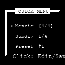

# Tap-A-Beat
A tactilely satisfying, and highly precise digital metronome and multi-tool for the person I care for.

**Tap-A-Beat** is an ESP32 based digital metronome packed with features in a compact form factor. It is designed to be responsive, precise, and a joy to use.

## Support my projects

If you like this project, consider a tip. Your tip motivates me to continue developing useful stuff for the DIY community. Thank you very much for your support!

## Table of Contents
- [Features](#features)
- [Functional Overview](#functional-overview)
- [Hardware Stack](#hardware-stack)
- [Project Structure](#project-structure)
- [User Interface Walkthrough](#user-interface-walkthrough)
- [Quick Reference Guide (Simplified)](QUICK_REFERENCE_GUIDE.md)
- [Release Notes (v1.3.0)](RELEASE_NOTES.md)
- [License](#license)

## Features

| Category | Feature | Description |
| :--- | :--- | :--- |
| **Timing** | **Precise Engine** | Dedicated FreeRTOS Audio Task on Core 0 ensures negligible drift and rock-solid timing. |
| **Audio** | **Natural Sound** | Synthesized "Woodblock" click with distinct Pitch for **Downbeats** (Accents) and **Upbeats**. |
| | **Subdivisions** | Support for **8th**, **16th**, and **Triple** subdivisions. |
| | **Feedback** | Audio Feedback during Tap-Tempo detection. |
| **Controls** | **Smart Inputs** | **Encoder** for everything. Press-and-Turn for Volume. Double-Click for Quick Menu. |
| | **Taptronic** | Tap the case to set BPM. Analyzes accents to detect **Time Signatures** automatically. |
| **Feedback** | **OLED Display** | Clear 128x128 interface with large beats and accent framing. |
| | **LED Ring** | WS2812 Support (Red=Accent, Blue=Beat). |
| | **Vibration** | **Exclusive Haptics:** Separate menu toggle. Motor activates **only at Volume 0** (Silent Practice). |
| **Tools** | **Tempo Trainer** | Automates speed increases over time (Start/End BPM, Step size, Bar interval). |
| | **Practice Timer** | Countdown timer (1-60m) for disciplined sessions. |
| | **Tuner** | Chromatic tuner with A4 reference adjustment (400–480Hz). |
| **System** | **Presets** | Save/Load **50 User Presets** organized in **5 Setlists**. |
| | **Power** | **Auto-Off** after 2 minutes of inactivity. **Wake-on-Button**. |

## Functional Overview & Controls

| Feature | Interaction / Control | Note |
| :--- | :--- | :--- |
| **Metronome** | **Turn Encoder**: BPM. **Click**: Play/Stop. **Push & Turn**: Volume. | High-precision timing (30-300 BPM). |
| **Silent Mode** | **Set Volume to 0**. Vibration is active **if enabled** in Menu. | **Vibration Menu**: Toggle ON/OFF. Prevents Vib+Audio simultaneous use. |
| **Taptronic** | **Menu** -> **Taptronic**. Tap rhythmically. | Now with **Audio Feedback** on detection. |
| **Quick Menu** | **Double Click** Button. | Fast access to Time Sig, Subdivisions, Presets. |
| **Preset Save/Load**| **Menu** -> **Presets**. **Hold Click**: Change Setlist. | Stores BPM, Metric, Volume, Tuner settings. |
| **Tuner** | **Menu** -> **Tuner**. **Click**: Toggle Reference Tone. | Visual flat/sharp indication + Audio Tone. |

## Hardware Stack

| Component | GPIO | Purpose |
| :--- | :--- | :--- |
| **MCU** | [LilyGO TTGO T7 V1.5 Mini32](https://lilygo.cc/products/t7-mini32-v1-5) | Brains & Processing (ESP32-WROVER-B, 8MB PSRAM) |
| **Audio Out** | I2S | MAX98357A I2S Amplifier |
| **Microphone** | I2S | INMP441 I2S Microphone |
| **Display** | I2C | 1.12" OLED (SH1107/SSD1327) |
| **Input** | 32/33 | Rotary Encoder (EC11) |
| **Haptics** | 13 | Vibration Motor (PWM) |
| **LED** | 4 | WS2812 / NeoPixel |
| **Power** | 36 | Battery Voltage Divider |

**Note on T7 V1.5:** This board uses the ESP32-WROVER-B module. GPIOs 16 and 17 are used internally for PSRAM and are not available. The headers expose GPIO 25 and 27 instead (which we use for I2S Audio Out).

## Project Structure

- `src/main.cpp`: Main application logic, UI, and state machine.
- `src/AudioEngine.cpp`: High-priority I2S audio task and synthesis.
- `src/Tuner.cpp`: Microphone handler and FFT logic.
- `include/config.h`: Pin definitions and hardware configuration.
- `platformio.ini`: Dependency management and build environment settings.

## User Interface Walkthrough

since this project uses a 128x128 OLED, the interface is designed to be high-contrast and readable.

**1. Main Controls (Play Screen)**
- **Turn Encoder:** Adjust BPM immediately.
- **Short Click:** Toggle Play / Stop.
- **Push & Turn (Hold and Twist):** Adjust Volume (Volume Overlay appears).
- **Double Click:** Open **Quick Menu** (Time Sig, Subdivisions, Presets).
- **Long Press (> 1s):** Enter **Main Menu** (Trainer, Tuner, Settings).

**2. Feedback & Silent Mode**
Tap-A-Beat supports multi-sensory feedback:
- **Audio:** High-fidelity woodblock sample.
- **Visual (WS2812 LED):** The Top-Mounted LED flashes in sync with the beat.
  - **Red:** Accent (Beat 1).
  - **Blue:** Sub-beats.
- **Haptic (Vibration):** The device vibrates on every beat.
- **Silent Mode:** Turn the Volume down to 0 using **Push & Turn**. The audio will mute, but the **LED** and **Vibration Motor** will continue to operate, allowing for discrete, silent tempo keeping.

**3. The Metronome Screen (Main View)**
This is the default view. It shows the current BPM, Volume, and provides a visual beat indicator.

**4. The Quick Menu (Double Click)**
Accessible by double-clicking the encoder. Allows fast changes to Metric, Subdivision, and Presets without stopping the flow.

**5. The Main Menu**
Accessible by holding the encoder. Navigate by rotating, select by clicking.

**6. Adjustment Sub-Screens**
For setting precise values like BPM or Time Signature, the UI switches to a focused view.

**7. Tap Tempo (Heart Mode)**
Make the heart beat! Emphasize the first beat of a bar to automatically set the **Time Signature** (e.g. 3/4). The UI displays "ACC!" for recognized accents. The sensitivity threshold is represented by the heart's outline.

## License

This project is licensed under the **PolyForm Noncommercial License 1.0.0**.

- **Noncommercial Use**: You may use this software for personal, educational, or evaluation purposes.
- **Commercial Use Restricted**: You may NOT use this software for commercial purposes (selling, paid services, business use) without prior written consent.

View Full License Text

### PolyForm Noncommercial License 1.0.0

#### 1. Purpose
This license allows you to use the software for noncommercial purposes.

#### 2. Agreement
In order to receive this license, you must agree to its rules. The rules of this license are both obligations (like a contract) and conditions to your license. You must not do anything with this software that triggers a rule that you cannot or will not follow.

#### 3. License Grant
The licensor grants you a copyright license for the software to do everything you might do with the software that would otherwise infringe the licensor's copyright in it for any permitted purpose. However, you may only do so to the extent that such use does not violate the rules.

#### 4. Permitted Purpose
A purpose is a permitted purpose if it consists of:
1. Personal use
2. Evaluation of the software
3. Development of software using the software as a dependency or evaluation tool
4. Educational use

**Commercial use is strictly prohibited without prior written consent from the author.**

#### 5. Rules

##### 5.1. Noncommercial Use
You must not use the software for any commercial purpose. A commercial purpose includes, but is not limited to:
1. Using the software to provide a service to third parties for a fee.
2. Selling the software or a derivative work.
3. Using the software in a commercial environment or business workflow.

##### 5.2. Notices
You must ensure that anyone who gets a copy of any part of the software from you also gets a copy of these terms or the URL for them above, as well as copies of any copyright notice or other rights notice in the software.

#### 6. Disclaimer
**THE SOFTWARE IS PROVIDED "AS IS", WITHOUT WARRANTY OF ANY KIND, EXPRESS OR IMPLIED, INCLUDING BUT NOT LIMITED TO THE WARRANTIES OF MERCHANTABILITY, FITNESS FOR A PARTICULAR PURPOSE AND NONINFRINGEMENT.**

