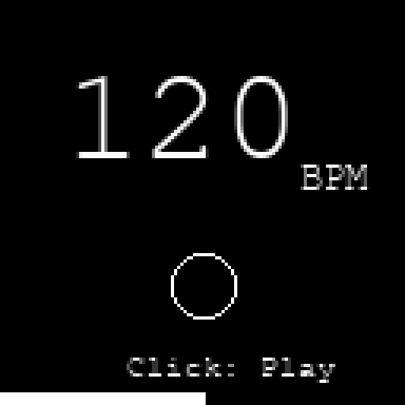
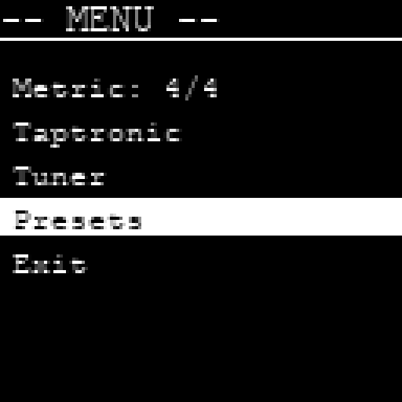
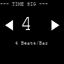
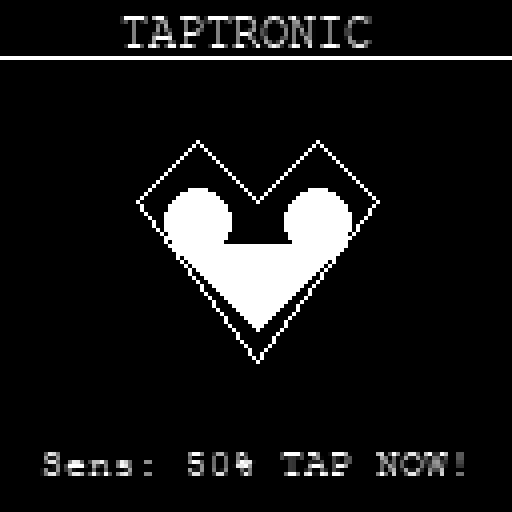

# Tap-A-Beat
A tactilely satisfying, and highly precise digital metronome and multi-tool for the person I care for.

**Tap-A-Beat** is an ESP32 based digital metronome packed with features in a compact form factor. It is designed to be responsive, precise, and a joy to use.

## Features

- **Precise Timing:** Drifts are negligible thanks to a dedicated FreeRTOS Audio Task running on the ESP32's Core 0, decoupled from UI logic.
- **Natural Sound:** Synthesized "Woodblock" click sound for a pleasant, organic practicing experience.
- **Visual Feedback:** 
  - **OLED:** Large, easy-to-read beat counter with accent framing.
  - **LED:** WS2812/NeoPixel support (Red=Accent, Blue=Beat).
- **Haptic Feedback:** Integrated PWM haptic engine for silent practice with distinct accent pulses.
- **Smart Inputs:** 
  - **Tap Tempo:** Set BPM by tapping the enclosure (via built-in mic) or clapping.
  - **Encoder:** Debounced rotary control with "Press-and-Turn" volume shortcut.
- **Tuner:** Full chromatic tuner with adjustable A4 reference (400–480Hz) and AGC (Automatic Gain Control) for stable detection.
- **Persistence & Presets:** Automatically saves settings; **5 User Presets** for quick set-list changes.
- **Power Management:** Deep sleep auto-off with wake-on-button.

## Hardware Stack

| Component | GPIO | Purpose |
| :--- | :--- | :--- |
| **MCU** | [LilyGO TTGO T7 V1.5 Mini32](https://lilygo.cc/products/t7-mini32-v1-5) | Brains & Processing (ESP32-WROVER-B, 8MB PSRAM) |
| **Audio Out** | I2S | MAX98357A I2S Amplifier |
| **Microphone** | I2S | INMP441 I2S Microphone |
| **Display** | I2C | 1.12" OLED (SH1107/SSD1327) |
| **Input** | 32/33 | Rotary Encoder (EC11) |
| **Haptics** | 13 | Vibration Motor (PWM) |
| **LED** | 4 | WS2812 / NeoPixel |
| **Power** | 36 | Battery Voltage Divider |

**Note on T7 V1.5:** This board uses the ESP32-WROVER-B module. GPIOs 16 and 17 are used internally for PSRAM and are not available. The headers expose GPIO 25 and 27 instead (which we use for I2S Audio Out).

## Project Structure

- `src/main.cpp`: Main application logic, UI, and state machine.
- `src/AudioEngine.cpp`: High-priority I2S audio task and synthesis.
- `src/Tuner.cpp`: Microphone handler and FFT logic.
- `include/config.h`: Pin definitions and hardware configuration.
- `platformio.ini`: Dependency management and build environment settings.

## User Interface Walkthrough

since this project uses a 128x128 OLED, the interface is designed to be high-contrast and readable.

**1. Main Controls**
- **Short Click:** Toggle Play / Stop.
- **Long Press (> 0.5s):** Toggle Volume Focus. (Turn encoder to adjust, Click to return to BPM).
- **Very Long Press (> 2s):** Enter Main Menu.
- **Encoder Turn:** Adjust BPM (or Volume if focused).

**2. Feedback & Silent Mode**
Tap-A-Beat supports multi-sensory feedback:
- **Audio:** High-fidelity woodblock sample.
- **Visual (WS2812 LED):** The Top-Mounted LED flashes in sync with the beat.
  - **Red:** Accent (Beat 1).
  - **Blue:** Sub-beats.
- **Haptic (Vibration):** The device vibrates on every beat.
- **Silent Mode:** Turn the Volume down to 0 using the **Volume Focus** (Long Press). The audio will mute, but the **LED** and **Vibration Motor** will continue to operate, allowing for discrete, silent tempo keeping.

**3. The Metronome Screen (Main View)**
This is the default view. It shows the current BPM, Volume, and provides a visual beat indicator.

**2. The Main Menu**
Accessible by clicking the encoder. Navigate by rotating, select by clicking.

**3. Adjustment Sub-Screens**
For setting precise values like BPM or Time Signature, the UI switches to a focused view.

**4. Tap Tempo (Heart Mode)**
Make the heart beat! The sensitivity threshold is represented by the heart's outline.

